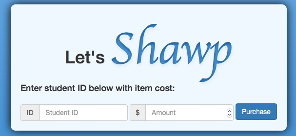

# Shawp
<i>A school store user interface...</i>

The purpose of this site is to manage a points system developed by a school.

It has <b>two</b> UIs to work from. 

The <b>front-end</b> is accessible to anyone signed in and is only capable of viewing student points from the database.

The <b>back-end</b> is password protected and requires an active session to access (keeping kids from being able to access it). Here users are capable of making purchases (subtracting) from the database or adding / setting points to student IDs.

I used <i>ajax/jquery</i> to submit/receive form data to my php files. This was also the first time I used <b>bootbox</b>! I found it to be a very useful tool when dealing with prompts. 
